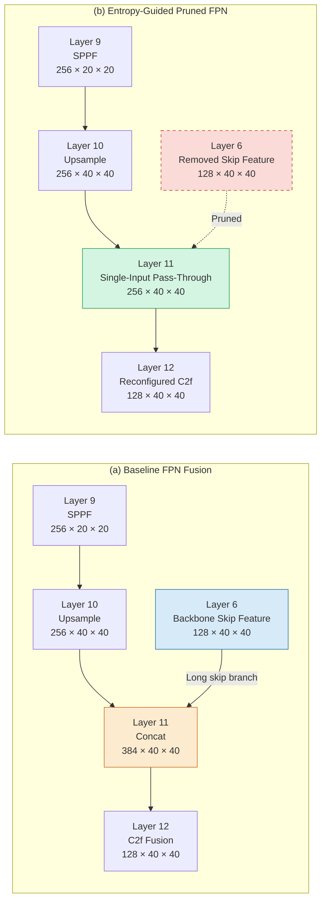

# Figure 2: FPN Topology Before and After Entropy-Guided Pruning

**Figure 2. FPN topology before and after entropy-guided branch pruning.** The baseline model concatenates the Layer 6 backbone feature with the upsampled Layer 9 feature at Layer 11. The proposed configuration removes the Layer 6-to-Layer 11 skip branch and reconfigures the subsequent C2f block for the reduced input-channel dimension.
